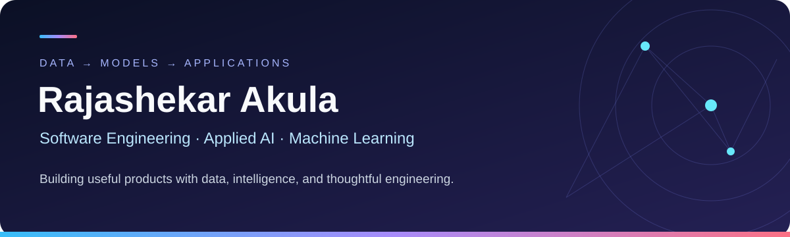

  

  <a href="#-featured-projects">Explore projects</a> ·
  <a href="#-tools-i-build-with">My toolkit</a> ·
  <a href="#-the-story-behind-the-code">My story</a>

  
  
  
  

I build applications that turn data into useful decisions—combining **machine learning, grounded AI assistants, backend APIs, and interactive web experiences**.

My current projects explore retail inventory, energy demand, hospital operations, and personalized restaurant discovery. I enjoy connecting the full journey: **a practical question → reliable data → an evaluated model → a useful application**.

## 🚀 Featured projects

<table>
<tr>
<td width="50%" valign="top">

### 📦 ShelfSignal

**Retail intelligence + grounded AI**

Seven-day stockout risk, evaluated alerts, and a local RAG assistant with evidence citations.

XGBoost · FastAPI · React · Ollama

[Explore code ↗](https://github.com/rajashekarakula19-spec/retail-stockout-early-warning) · [Open dashboard ↗](https://rajashekarakula19-spec.github.io/retail-stockout-early-warning/)

</td>
<td width="50%" valign="top">

### ⚡ Voltart

**Energy analytics + forecasting**

Industrial cost analysis and 14-day demand forecasts with actual-versus-predicted backtests.

scikit-learn · Python · Next.js

[Explore code ↗](https://github.com/rajashekarakula19-spec/industrial-energy-analytics-and-electricity-demand-forecasting)

</td>
</tr>
<tr>
<td width="50%" valign="top">

### 🏥 Finger Lakes

**Healthcare operations research**

Case-mix-adjusted length-of-stay and cost benchmarking with uncertainty and statistical controls.

Python · scikit-learn · FastAPI

[Explore code ↗](https://github.com/rajashekarakula19-spec/los-pjt) · [Open dashboard ↗](https://rajashekarakula19-spec.github.io/los-pjt/)

</td>
<td width="50%" valign="top">

### 🍜 FooLover

**Personalized discovery + local AI**

Restaurant search, meal planning, map exploration, and optional local LLM interpretation.

React · TypeScript · Ollama · PostGIS

[Explore code ↗](https://github.com/rajashekarakula19-spec/Foolover)

</td>
</tr>
</table>

<b>🔎 Explore the methods and demo details</b>

- **ShelfSignal:** Chronological validation, frozen alert thresholds, baseline comparisons, and lead-time-aware evaluation. Full RAG requires the backend and Ollama; the public dashboard uses static demonstrations. Historical loss estimates are not demonstrated savings.
- **Voltart:** Gradient-boosting demand forecasts and cost analytics using synthetic industrial data.
- **Finger Lakes:** A retrospective research prototype using 2024 NY SPARCS data, out-of-fold modeling, uncertainty intervals, and false-discovery-rate controls. Results prioritize human investigation.
- **FooLover:** Local language-model interpretation and recommendation ranking with heuristic fallbacks. Menus, prices, and wait estimates include demo data.

## 🧰 Tools I build with

  

Python · TypeScript · JavaScript · React · Next.js · FastAPI · PostgreSQL · Docker · Git · GitHub

  
  
  
  
  
  

<b>🛠️ How I use this toolkit</b>

| Area | My project work |
| --- | --- |
| Software engineering | APIs, application interfaces, React dashboards, and data integration |
| Applied machine learning | Feature engineering, gradient boosting, recommendation ranking, and time-series forecasting |
| Generative AI | Local LLM integration, evidence retrieval, grounded answers, and citation validation |
| Evaluation | Temporal validation, backtesting, retrieval evaluation, and statistical benchmarking |
| Delivery | Docker, automated tests, and GitHub Pages portfolio dashboards |

## 💡 The story behind the code

<b>Read my engineering story</b>

I approach software through practical questions. Can a retailer spot stockout risk early enough to investigate? Can an energy dashboard explain yesterday's costs and forecast tomorrow's demand? Can hospital comparisons account for differences in the patients they serve?

These questions shape how I work across the stack—from preparing data and evaluating models to building APIs and designing the interface where someone explores the results. My projects combine Python-based analytics and machine learning with web development in TypeScript and React.

I'm also bringing generative AI into these workflows. In ShelfSignal, a retrieval-grounded assistant explains project evidence with citations. In FooLover, optional local language-model interpretation connects natural-language requests to restaurant discovery. These projects let me explore how predictive models, language models, and application logic can work together.

My engineering priorities are clear evaluation, traceable answers, and honest communication of what a system can support. I want someone exploring my work to understand both how it was built and why its results matter.

## 🌱 Where I'm heading

**Building on now:** grounded AI assistants, local model integration, and evaluation-driven ML applications.

**Exploring next:** tool-using AI workflows and stronger MLOps practices for reproducibility, monitoring, and deployment.

I'm interested in **software, AI, and ML opportunities** where I can connect thoughtful modeling with practical application development.

---

<b>Explore the code. Open a dashboard. Follow the ideas.</b>  
<a href="https://github.com/rajashekarakula19-spec?tab=repositories">Browse all repositories ↗</a>

<!-- Technology icons: https://skillicons.dev | Badges: https://shields.io -->
